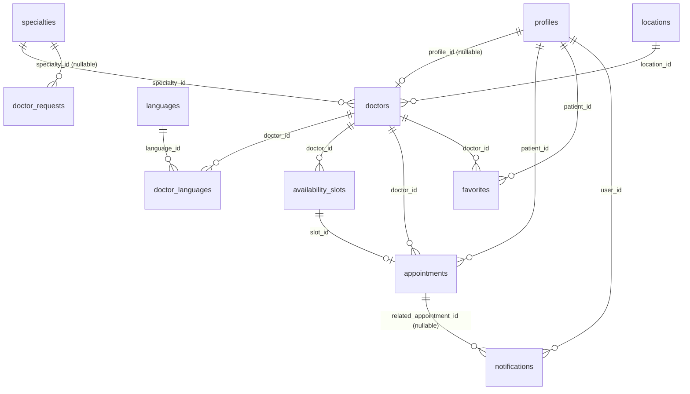

# MedRDV — Database Schema & Table Relationships

> Interview-prep notes, not a deliverable from the assignment brief.

## Diagram



*(`doctor_requests` sits apart from the rest — this is intentional: it's a simple public form, no row there ever automatically creates an account or a doctor record.)*

## Full table list (11 tables + 1 standalone)

| Table | Purpose |
|---|---|
| `profiles` | User profile + role (patient/doctor/admin), 1-to-1 with a Supabase Auth account |
| `doctors` | Doctor listing (name, bio, photo, phone, optionally linked to a profile) |
| `specialties` | Specialty catalog |
| `locations` | Tel-Aviv neighborhood catalog |
| `languages` / `doctor_languages` | Spoken languages (many-to-many relation) |
| `availability_slots` | A doctor's free/booked/blocked time windows |
| `appointments` | Booked appointments |
| `favorites` | A patient's favorited doctors |
| `notifications` | In-app notifications |
| `doctor_requests` | Public "request to join" form from real-world doctors (no self-signup) |

Plus **SQL business-logic functions** (`SECURITY DEFINER`) that are an integral part of the architecture, not just helper utilities: `book_appointment()`, `reschedule_appointment()`, `cancel_appointment()`, `is_admin()`, `is_doctor_owner()`, `doctor_visible_patients()`.

## Complete foreign key table

| Child table | FK column | References | ON DELETE | Meaning |
|---|---|---|---|---|
| `profiles` | `id` | `auth.users(id)` | `cascade` | Every profile is 1-to-1 with a Supabase Auth account |
| `doctors` | `profile_id` | `profiles(id)` | `set null` | A doctor can exist **without** a login account (created by an admin before the account is linked) — see below |
| `doctors` | `specialty_id` | `specialties(id)` | `restrict` | A specialty used by a doctor cannot be deleted |
| `doctors` | `location_id` | `locations(id)` | `restrict` | Same for a neighborhood in use |
| `doctor_languages` | `doctor_id`, `language_id` | `doctors(id)`, `languages(id)` | `cascade` (both) | Many-to-many join table (composite primary key) |
| `availability_slots` | `doctor_id` | `doctors(id)` | `cascade` | Deleting a doctor deletes their slots |
| `appointments` | `slot_id` | `availability_slots(id)` | `restrict` | A booked slot can't be deleted while an appointment references it |
| `appointments` | `patient_id` | `profiles(id)` | `restrict` | History preserved even if — in theory — a profile were deleted |
| `appointments` | `doctor_id` | `doctors(id)` | `restrict` | Same |
| `favorites` | `patient_id` | `profiles(id)` | `cascade` | Unique constraint `(patient_id, doctor_id)` — a patient can't favorite the same doctor twice |
| `favorites` | `doctor_id` | `doctors(id)` | `cascade` | |
| `notifications` | `user_id` | `profiles(id)` | `cascade` | |
| `notifications` | `related_appointment_id` | `appointments(id)` | `set null` | Optional — a generic notification isn't necessarily tied to an appointment |
| `doctor_requests` | `specialty_id` | `specialties(id)` | `set null` | Optional, standalone public form |

## A subtlety worth mastering for the interview

**Why is `doctors.profile_id` nullable**, when `doctors.full_name` duplicates `profiles.full_name`? Because the business workflow is: *the admin first creates the doctor record (name, specialty, neighborhood...) → then, separately, links a real login account to it*. Between those two steps, the doctor "exists" in the catalog (visible in search if `is_active = true`) without having any auth account at all — so their name has to be stored directly on `doctors`, not only fetched via a join to `profiles`.

## Row Level Security (RLS) — the authorization ground truth

Every table has RLS enabled, and policies are always keyed on `auth.uid()` (the identity resolved from the JWT, never a client-supplied parameter). Key examples:

```sql
-- profiles
profiles_select_own_or_admin  : for select using (id = auth.uid() or is_admin())
profiles_insert_own           : for insert with check (id = auth.uid())

-- doctors (public catalog, admin-only writes)
doctors_select_active_or_owner_or_admin : for select using (is_active = true or profile_id = auth.uid() or is_admin())
doctors_admin_write                     : for all using (is_admin()) with check (is_admin())

-- availability_slots
availability_slots_write_owner_or_admin : for all using (is_doctor_owner(doctor_id) or is_admin())

-- appointments
appointments_select_own_or_admin : the patient sees their own, the doctor sees their own, the admin sees all

-- favorites
favorites_all_own : for all using (patient_id = auth.uid()) with check (patient_id = auth.uid())

-- notifications
notifications_select_own : for select using (user_id = auth.uid())
notifications_update_own : for update using (user_id = auth.uid())
```

Note also: direct `INSERT` on `public.appointments` is explicitly **revoked** from `anon` and `authenticated` roles (a separate migration) — the RLS insert policy still exists on paper, but the only real path to create an appointment row is the `book_appointment()` `SECURITY DEFINER` function, which bypasses RLS internally and resolves the patient from `auth.uid()`, never from a parameter.
